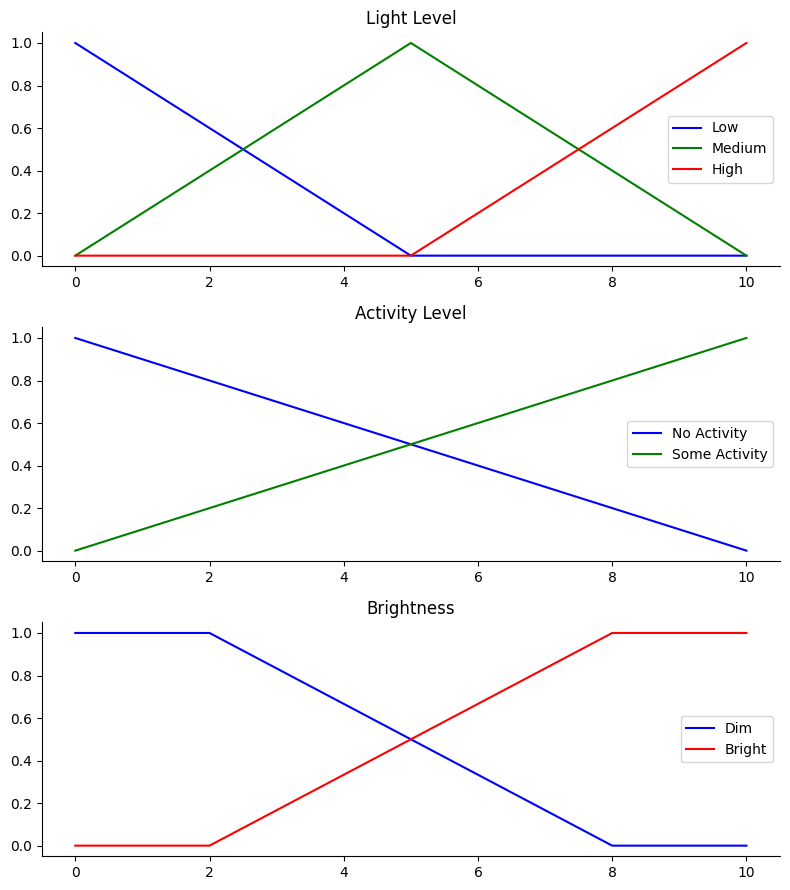
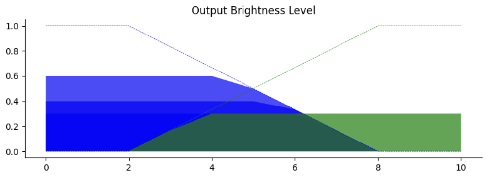

# Kontrol Kecerahan dengan Logika Fuzzy

Proyek ini mengimplementasikan sistem logika fuzzy untuk mengontrol kecerahan lampu berdasarkan tingkat cahaya sekitar dan tingkat aktivitas. Sistem ini menggunakan fungsi keanggotaan fuzzy dan aturan untuk menentukan tingkat kecerahan yang sesuai.

## Daftar Isi

- [Instalasi](#instalasi)
- [Penggunaan](#penggunaan)
- [Struktur Proyek](#struktur-proyek)
- [Sistem Logika Fuzzy](#sistem-logika-fuzzy)
- [Contoh Penggunaan](#contoh-penggunaan)
- [Anggota Kelompok](#anggota-kelompok)

## Instalasi

Untuk memulai proyek ini, Anda perlu mengkloning repositori dan menginstal dependensi yang diperlukan.

### Prasyarat

Pastikan Anda telah menginstal Python 3.12 di sistem Anda. Anda dapat mengunduh Python dari situs resmi [Python](https://www.python.org/).

### Klon Repositori

```sh
git clone https://github.com/AvavSam/kel7-logikaPencahayaan.git
cd kel7-logikaPencahayaan
```

### Membuat Lingkungan Virtual

Sebaiknya buat lingkungan virtual untuk mengelola dependensi proyek Anda. Anda dapat membuat lingkungan virtual menggunakan `venv`:

```sh
python -m venv sklearn-env
```

Aktifkan lingkungan virtual:

- Di Windows:

    ```sh
    venv\Scripts\activate
    ```

- Di macOS dan Linux:

    ```sh
    source venv/bin/activate
    ```

### Instal Dependensi

Instal paket Python yang diperlukan menggunakan `pip`:

```sh
pip install numpy scikit-learn matplotlib setuptools
```

## Contoh Penggunaan

Anda dapat mengubah variabel `light_value` dan `activity_value` dalam skrip `main.py` untuk melihat bagaimana sistem merespons berbagai input.

```python
light_value = 7
activity_value = 3
```

## Struktur Proyek

Proyek ini diorganisir sebagai berikut:

```
kel7-logikaPencahayaan/
│
├── app.ipynb             # Skrip utama untuk menjalankan sistem logika fuzzy
└── README.md             # Dokumentasi proyek
```

## Sistem Logika Fuzzy

Sistem logika fuzzy menggunakan tiga variabel input dan satu variabel output:

- **Variabel Input:**
  - `light_level`: Mewakili tingkat cahaya sekitar (rentang: 0 hingga 10).
  - `activity_level`: Mewakili tingkat aktivitas di lingkungan (rentang: 0 hingga 10).

- **Variabel Output:**
  - `brightness`: Mewakili tingkat kecerahan lampu (rentang: 0 hingga 10).

### Fungsi Keanggotaan

Fungsi keanggotaan untuk variabel input dan output didefinisikan menggunakan fungsi segitiga dan trapesium:

- Tingkat Cahaya:
  - Rendah (`light_lo`): Fungsi keanggotaan segitiga.
  - Sedang (`light_md`): Fungsi keanggotaan segitiga.
  - Tinggi (`light_hi`): Fungsi keanggotaan segitiga.

- Tingkat Aktivitas:
  - Tidak Ada Aktivitas (`activity_no`): Fungsi keanggotaan segitiga.
  - Ada Aktivitas (`activity_some`): Fungsi keanggotaan segitiga.

- Kecerahan:
  - Redup (`brightness_lo`): Fungsi keanggotaan trapesium.
  - Terang (`brightness_hi`): Fungsi keanggotaan trapesium.

### Aturan Fuzzy

Sistem ini menggunakan aturan fuzzy berikut untuk menentukan tingkat kecerahan:

1. Jika tingkat cahaya rendah dan tidak ada aktivitas, maka kecerahan redup.
2. Jika tingkat cahaya sedang dan tidak ada aktivitas, maka kecerahan redup.
3. Jika tingkat cahaya tinggi dan tidak ada aktivitas, maka kecerahan redup.
4. Jika tingkat cahaya rendah dan ada aktivitas, maka kecerahan terang.
5. Jika tingkat cahaya sedang dan ada aktivitas, maka kecerahan terang.
6. Jika tingkat cahaya tinggi dan ada aktivitas, maka kecerahan redup.

## Contoh

Plot berikut dihasilkan oleh skrip `app.ipynb` untuk memvisualisasikan fungsi keanggotaan dan tingkat kecerahan output:

### Fungsi Keanggotaan Input



### Tingkat Kecerahan Output



### Kecerahan Terkumpul dan Hasilnya


## Anggota Kelompok

| No. | Nama                | Nim         |
|:---:|:-------------------:|:-----------:|
| 1.  | [Mohammad Raiyan](https://github.com/Raaiyaann)     | F551 23 001 |
| 2.  | [Avav Abdillah Sam](https://github.com/AvavSam)   | F551 23 020 |
| 3.  | [Nakita Semesta](https://github.com/SemestaaaaA)      | F551 23 032 |
| 4.  | [Rizka Filardi Toliz](https://github.com/rizkafilardi) | F551 23 034 |
| 5.  | [Sofia Qatrunnada](https://github.com/Sfqtrnd)    | F551 23 035 |
